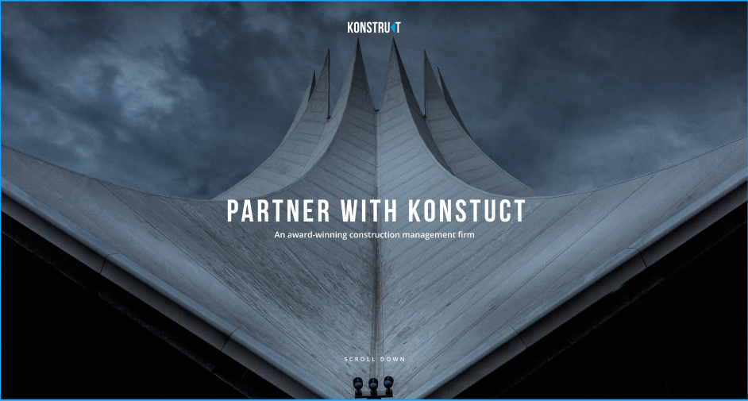
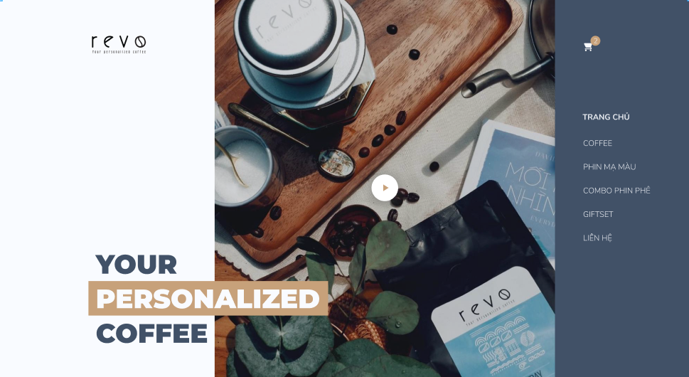
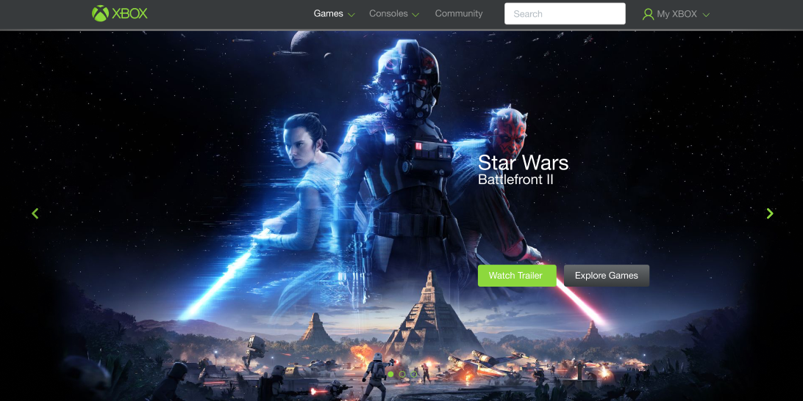

## Сайт компании Construct

<figure>

<figcaption>Макет Construct. Сложность низкая</figcaption>
</figure>

<a href="https://www.figma.com/file/zR1XfguUZ5wWWOy6ah30Xq/konstruct-template" target="_blank">Ссылка на макет</a>

Неплохой простенький сайт для верстки на день, почему бы и нет.

__Сложность:__ низкая

## Coffee site

<figure>

<figcaption>Макет Coffee. Сложность средняя</figcaption>
</figure>

<a href="https://www.figma.com/file/COFJnHB1lL47wFuw42t1Tx/Freebie_Coffee" target="_blank">Ссылка на макет</a>

Красивый сайт с нестандартными элементами, очень интересно будет поверстать на досуге.

__Сложность:__ средняя

## IMDb Concept

<figure>

<figcaption>Макет IMDb. Сложность средняя</figcaption>
</figure>

<a href="https://www.figma.com/file/j4dslZZvb5b9JLSEYQYKMo/imdb_concept" target="_blank">Ссылка на макет</a>

Концепт сайта IMDb (зарубежный кинопоиск). Есть что поверстать, интересная сетка.

__Сложность:__ средняя

## Xbox Langing page

<figure>

<figcaption>Макет Xbox. Сложность низкая</figcaption>
</figure>

<a href="https://www.figma.com/file/ykE2koNH98kf6AHQpaXAKi/xbox" target="_blank">Ссылка на макет</a>

Неплохой одностраничник про xbox. В целом, ничего сложного.

__Сложность:__ низкая

## Index Agency

<figure>

<figcaption>Макет Agency. Сложность средняя</figcaption>
</figure>

<a href="https://www.figma.com/file/fn7TA4MCrTj7Ad2dAPja7Q/Freebie-Agency" target="_blank">Ссылка на макет</a>

Красивый и минималистичный лендинг. Думаю, на средний уровень подойдет.

__Сложность:__ средняя

Пока это все, на самом деле найти адекватные макеты для figma не так уж и просто, но будем стараться) Если же вы хотите еще, или хотите сборник psd-макетов от меня — пишите в комментарии, и все будет!

Всем добра, удачи в верстке макетов)
