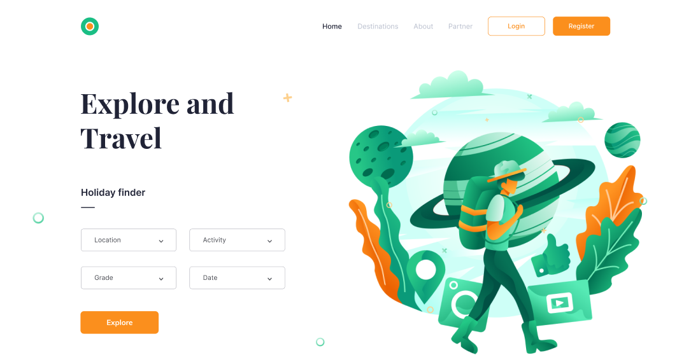
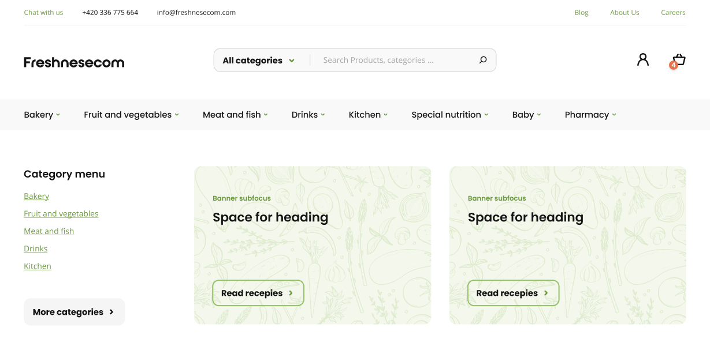

## Alivio template

<figure>

<figcaption>Макет Alivio. Сложность низкая</figcaption>
</figure>

<a href="https://www.figma.com/file/ZRT1lTxs8KQtlbvl33dMRb/alivio-landing-page-for-figma?node-id=0%3A1" target="_blank">Ссылка на макет</a>

Простой сайт с простой сеткой. Для практики самое то.

__Сложность:__ низкая

## Tour site

<figure>

<figcaption>Макет Tour. Сложность низкая</figcaption>
</figure>

<a href="https://www.figma.com/file/eOWwwvjcB8hFIOC3yx2Hwc/tour-and-travel-website-for-figma?node-id=0%3A1" target="_blank">Ссылка на макет</a>

Еще один простой макет лендинга.

__Сложность:__ низкая

## Макет интернет-магазина Freshnesecom

<figure>

<figcaption>Макет Freshnesecom. Сложность высокая</figcaption>
</figure>

<a href="https://www.figma.com/file/1PGSbfvK9aqGqMlN1utBRD/Figma-eCommerce-template?node-id=2%3A1713" target="_blank">Ссылка на макет</a>

Интересный макет интернет-магазина. Для отработки многостраничников)

__Сложность:__ высокая (из-за объема)

## Shopka template

<figure>

<figcaption>Макет Shopka. Сложность средняя</figcaption>
</figure>

<a href="https://www.figma.com/file/4pghvOmXcEXXD5E4Co5cPa/Ecommerce-Desktop-Template-Copy?node-id=1%3A5045" target="_blank">Ссылка на макет</a>

Одна страничка из интернет-магазина.

__Сложность:__ средняя

## Webovio template

<figure>

<figcaption>Макет Webovio. Сложность низкая</figcaption>
</figure>

<a href="https://www.figma.com/file/2rdy1qjBTl7D6BAC8S4qlf/Webovio?node-id=0%3A1" target="_blank">Ссылка на макет</a>

Простой макет, но с интересной сеткой.

__Сложность:__ низкая

Ну и пока все) буду еще искать для вас крутые макеты.

Удачи в верстке!)
