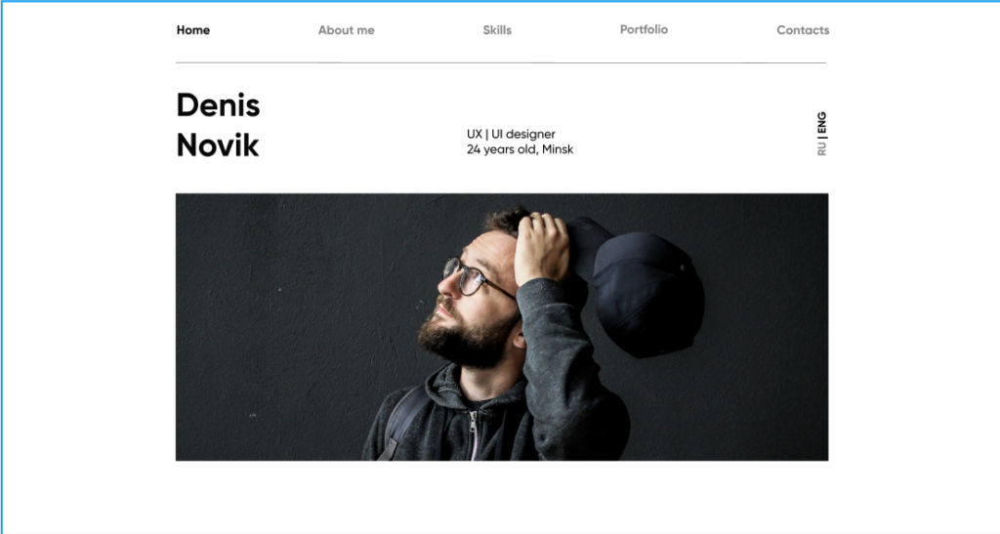
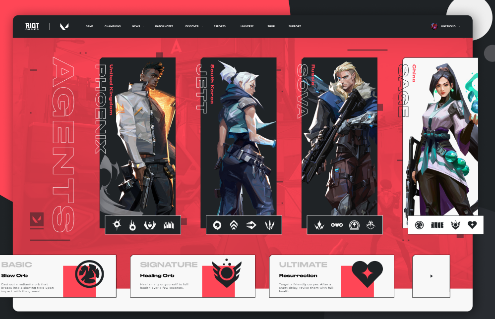
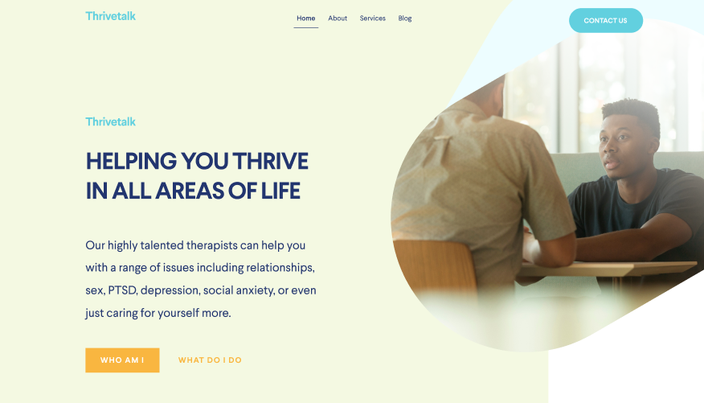

## Portfolio landing page

<figure>

<figcaption>Макет портфолио. Сложность низкая</figcaption>
</figure>

<a href="https://www.figma.com/file/5D9pDuLtS042hzaoN69Kd7/Free-Landing-Page-Template?node-id=0%3A1" target="_blank">Ссылка на макет</a>

Классный сайт для портфолио, лично мне нравится простой и чистый дизайн.

__Сложность:__ низкая

## Clean simple landing page

<figure>

<figcaption>Макет productivity. Сложность средняя</figcaption>
</figure>

<a href="https://www.figma.com/file/8T4byFDAV5REmnVyQlsFO1/clean_and_simple_website_freebie_work_file?node-id=0%3A1" target="_blank">Ссылка на макет</a>

Довольно простой по дизайну, но не самый простой в плане верстки сайт. Есть что отработать (декоративные элементы, слайдеры и т.д.)

__Сложность:__ средняя

## Client chat

<figure>

<figcaption>Макет client chat. Сложность средняя</figcaption>
</figure>

<a href="https://www.figma.com/file/gBObzdn16Asemn3YSqDdFk/Chat-Desktop-App-macOS" target="_blank">Ссылка на макет</a>

Ооочень похоже на мессенджер Slack :) Но тем не менее, интересно такое сверстать, особенно в плане семантики.

__Сложность:__ средняя

## Restaurant template

<figure>

<figcaption>Макет ресторана. Сложность средняя</figcaption>
</figure>

<a href="https://www.figma.com/file/YMLK4BwcowltWe0ZyLgOyrOp/Hunger---Website-Template" target="_blank">Ссылка на макет</a>

Неплохой одностраничник на тему ресторана. Так же есть немало мелочей, которые можно отработать.

__Сложность:__ средняя

## Valorant concept

<figure>

<figcaption>Макет valorant. Сложность высокая</figcaption>
</figure>

<a href="https://www.figma.com/file/mc4NyQ8AYUV7KjImsy5cVY/Valorant---Agents-page-concept-design-(Community)" target="_blank">Ссылка на макет</a>

Концепт по недавно вышедшей игре Valorant. В целом, это не совсем макет сайта, но мне дизайн нравится, и в принципе, можно под себя переделать. Для практики — самое то)

__Сложность:__ высокая (только из-за нестандартного макета)

## Thrivetalk landing page

<figure>

<figcaption>Макет Thrivetalk. Сложность низкая</figcaption>
</figure>

<a href="https://www.figma.com/file/aHd2rHMrnzDXhowLuIQjIyVQ/ThriveTalk-Landing-Page" target="_blank">Ссылка на макет</a>

Простой лендинг, для отработки сеток (flexbox) самое то)

__Сложность:__ низкая

Пока это все, на самом деле найти адекватные макеты для figma не так уж и просто, но будем стараться) Если же вы хотите еще, или хотите сборник psd-макетов от меня — пишите в комментарии, и все будет!

Всем добра, удачи в верстке макетов)
