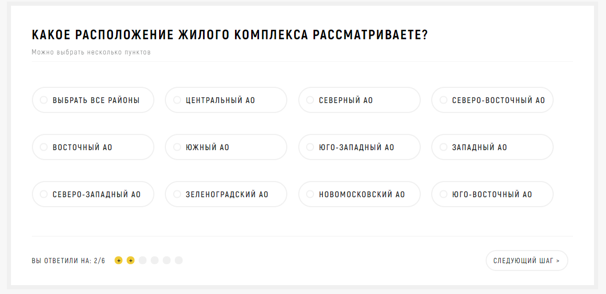

Итак, чекбоксы. Или же input type=»checkbox». В основном, наверное, вы встречали их на сайтах в виде галочки «я согласен с условиями политики конфеденциальности». Но нередко они используются и для конкретной отправки чего-либо заказчику сайта. И сегодня мы поговорим именно о Множественной отправке чекбоксов.

<figure>
  
  <figcaption>Несколько чекбоксов</figcaption>
</figure>

На фото выше — фрагмент типичного маркетингового квиза (когда пользователя ведут по вопросам, он отвечает на них, а затем, к примеру, получает скидку). Все данные, что он заполнил, утекают к заказчику.

Итак, в целом, мы могли бы написать что-то такое:

``` html
<input type="checkbox" name="Расположение-1" value="Центральный АО">
<input type="checkbox" name="Расположение-2" value="Северо-Восточный АО">
```

В таком случае на почту придет куча данных типа: _«check-1: Центральный АО», «check-2: Северо-Восточный АО»_. Надо ли нам такое, когда у нас куча чекбоксов? Сомнительно.

Для этого есть специальное значение name:

``` html
<input type="checkbox" name="Расположение[]" value="Центральный АО">
<input type="checkbox" name="Расположение[]" value="Северо-Восточный АО">
```

Теперь же, при правильном php-обработчике (такой я приложу к этой статье) мы будем получать: _«Расположение: Центральный АО, Северо-Восточный АО»_ и так далее. Суть в том, что одинаковые по сути (замыслу) чекбоксы делать одной сущностью, как бы «объединяя» их через одинаковый name. Но без квадратных скобок никуда, иначе придет ответом только самый нижний (в коде) из выбранных элементов.

Ну и еще по поводу связи с лейблами, если у вас множество чекбоксов — нет смысла (и вообще странно) использовать атрибут `for`.

``` html
<label>
  <input type="checkbox" name="Расположение[]" value="Центральный АО">
  <span>Центральный АО</span>
</label>
```

Тут и стилизовать через ~ очень легко будет :)

Как-то так. Пользуйтесь и не забывайте об этом)

<a href="/assets/files/mail.zip" download>mail.php</a>
