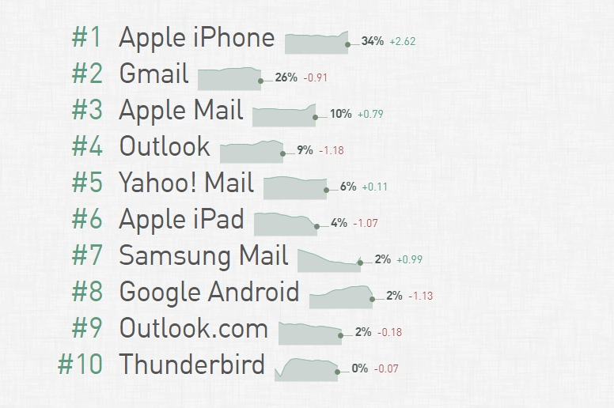

## Вступление

Важно: верстка писем&nbsp;&mdash; это далеко не&nbsp;верстка сайтов. И&nbsp;пусть вы&nbsp;думаете, что отличается только табличной версткой&nbsp;&mdash; это вовсе не&nbsp;так. Отличий куча, и&nbsp;таблицы&nbsp;&mdash; лишь одна из&nbsp;мелочей. В&nbsp;первой части мы&nbsp;как раз рассмотрим основные правила по&nbsp;верстке, во&nbsp;второй&nbsp;&mdash; инструменты, а&nbsp;в&nbsp;третьей&nbsp;я, в&nbsp;видео формате, поверстаю письмо и&nbsp;покажу, что и&nbsp;как.

## Поддержка

Думаю стоит сразу начать с&nbsp;щепетильного вопроса&nbsp;&mdash; поддержки html-почтовиков. Тут ситуация гораздо хуже, нежели поддержка браузеров, потому что по&nbsp;сути всем плевать на&nbsp;всех. Каждый почтовик работает как хочет.

К&nbsp;сожалению, нормальной статистики по&nbsp;российским почтовикам я&nbsp;не&nbsp;нашел, но&nbsp;думаю, что лучше поддерживать все. И&nbsp;исходя из&nbsp;этих данных, можно сказать, что нужна поддержка:

1. Apple почтовика
2. Gmail (ios, android, web)
3. outlook (ios, android, web)
4. yahoo (ios, android, web)
5. yandex (ios, android, web)
6. mail.ru (ios, android, web)

Как минимум все эти. И&nbsp;вроде&nbsp;бы все хорошо, но&nbsp;есть &laquo;прекрасная&raquo; вещь&nbsp;&mdash; outlook. Своего рода ie&nbsp;в&nbsp;мире почтовиков, в&nbsp;котором не&nbsp;работает очень много чего. Однако, он&nbsp;активно используется, и&nbsp;придется делать под него.

Как вы&nbsp;поняли, все не&nbsp;так уж&nbsp;радужно, но&nbsp;варианты и&nbsp;выходы&nbsp;&mdash; имеются.

## Правила

На&nbsp;самом деле правил очень много, я&nbsp;списком перечислю основное, а&nbsp;так&nbsp;же приложу ссылку на&nbsp;гугл-таблицу, где будет более полный список.

1. Использование инлайн-стилей
2. Табличная верстка
3. Если есть аналог css-стилей в&nbsp;виде html-атрибута&nbsp;&mdash; используем обязательно
Важно соблюдать порог размера письма&nbsp;&mdash; 102кб, т.к. некоторые почтовики, например Gmail, просто не&nbsp;покажут ваше письмо полностью. При этом, картинки не&nbsp;входят в&nbsp;этот размер.
5. Важно писать стили полностью, не&nbsp;сокращая, например padding-left, padding-right, а&nbsp;не&nbsp;просто padding. Это&nbsp;же правило относится к&nbsp;цветам&nbsp;&mdash; color: #ffffff, а&nbsp;не #fff
6. Очень важное правило&nbsp;&mdash; не&nbsp;использовать какие-то кастомные шрифты, только безопасные&nbsp;&mdash; такие, как arial, tahoma, verdana, helvetica и&nbsp;т.д. Ибо шрифты просто не&nbsp;работают)
7. Нужно стараться использовать пиксели вместо процентов и&nbsp;тем более иных единиц измерений.

Это лишь базовый список, на&nbsp;практике мы&nbsp;это все рассмотрим и&nbsp;посмотрим. Полный список&nbsp;&mdash; <a href="https://docs.google.com/spreadsheets/d/13KQyB75E4sZp3SdVd68QWg1NH2c5kkP9ZMFCML4SQaA/edit?usp=sharing" target="_blank">тут</a>.

Ну&nbsp;и&nbsp;наверное важнейшее правило&nbsp;&mdash; это тестировать код постоянно. Сделали блок&nbsp;&mdash; протестируйте в&nbsp;основных почтовиках, особенно в&nbsp;outlook. Это очень важно для вашей работы, иначе придется много переделывать)

В&nbsp;следующей части будут полезные ссылки, инструменты для проверки и&nbsp;т.д, а&nbsp;пока&nbsp;&mdash; можете глянуть видео в&nbsp;самом начале, там я&nbsp;верстаю письмо. До&nbsp;скорого!
